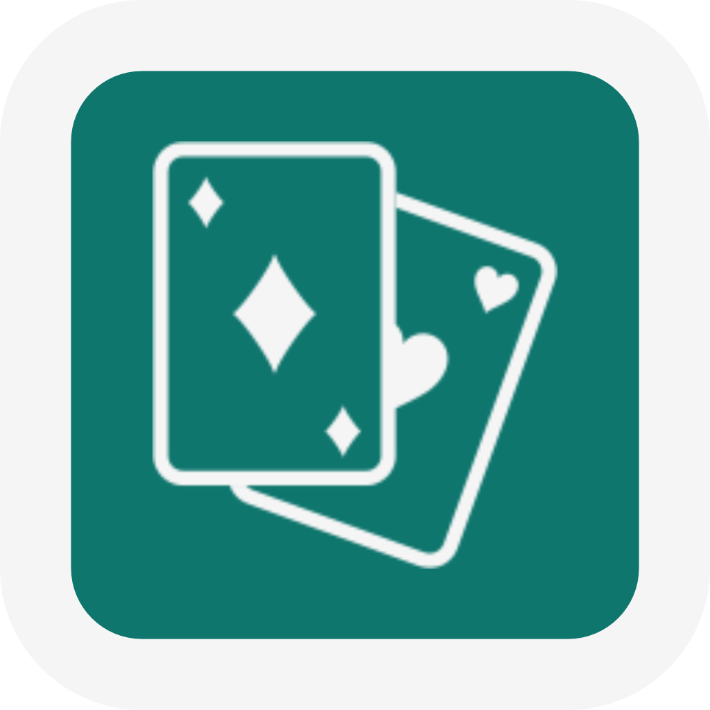

<h1 align="center">
  
  <br />
  Belot Card Game
</h1>

<p align="center">
  A fully playable iOS implementation of the classic Belot card game — with bots, trump selection, scoring, and declaration handling.
</p>

---

## What is Belot Card Game?

**Belot Card Game brings the classic Central European trick-taking card game to iOS:**

- Full Belot rules — tricks, declarations, and trump selection
- Play against intelligent bots with realistic decision-making
- Complete scoring system with round tracking
- Declaration handling — belot, sequences, and four-of-a-kind
- Built entirely in Swift as a final academic project

**`No account needed. No internet required. Just open and play.`**

---

## How It Works

Getting started with Belot Card Game is instant:

1. **Clone the repo** — `git clone https://github.com/nikomarinovic/Belot-Card-Game.git`
2. **Open in Xcode** — open `Belot-Card-Game.xcodeproj`
3. **Build & run** — target a simulator or physical device and hit Run
4. **Select trump** — choose your trump suit at the start of each round
5. **Play your hand** — follow tricks, declare combinations, and outscore your opponents

> [!TIP]
> Run on a physical iPhone for the best experience — card animations and touch interactions feel most natural on device.

---

## Installation

### Requirements

- Xcode 15 or later
- iOS 16.0+ target
- macOS with Xcode installed

### Steps
```bash
git clone https://github.com/nikomarinovic/Belot-Card-Game.git
```

Then open the project in Xcode:
```bash
open Belot-Card-Game.xcodeproj
```

Build and run using `Cmd+R` or the Run button in Xcode.

---

## Features

- **Bot Opponents** — play against AI players that follow Belot rules and make strategic decisions
- **Trump Selection** — full trump-calling flow at the start of every round
- **Declaration Handling** — belot, sequences (terza, kvarta, kvinta), and four-of-a-kind are detected and scored automatically
- **Scoring System** — points are calculated and tracked per round with a running total
- **Avatar System** — each player has a unique avatar for easy visual identification
- **Custom Card Assets** — full set of Belot playing cards included in the repo

---

## Project Structure
```bash
Belot-Card-Game/
├── Belot-Card-Game.xcodeproj/   # Xcode project file
├── Belot-Card-Game/             # Main Swift source files
├── avatar-images/               # Player avatar assets
└── belot playing cards/         # Full deck of card image assets
```

---

## Screenshots

<p align="center">
  
</p>

<p align="center">
  
</p>

<p align="center">
  
</p>

---

## Data & Privacy

Belot Card Game stores no user data. All game state is local — nothing is transmitted or persisted outside the app session.

> [!NOTE]
> This project was developed as a final academic project. It is published for viewing, learning, and portfolio purposes.

> [!WARNING]
> You may not redistribute, modify, or use this code to build derivative applications without explicit permission from the author.

---

<h3 align="center">
  Belot Card Game does not accept feature implementations via pull requests.<br />
  Feature requests and bug reports are welcome through GitHub Issues.
</h3>

---

<p align="center">
  © 2026 Niko Marinović. All rights reserved.
</p>
