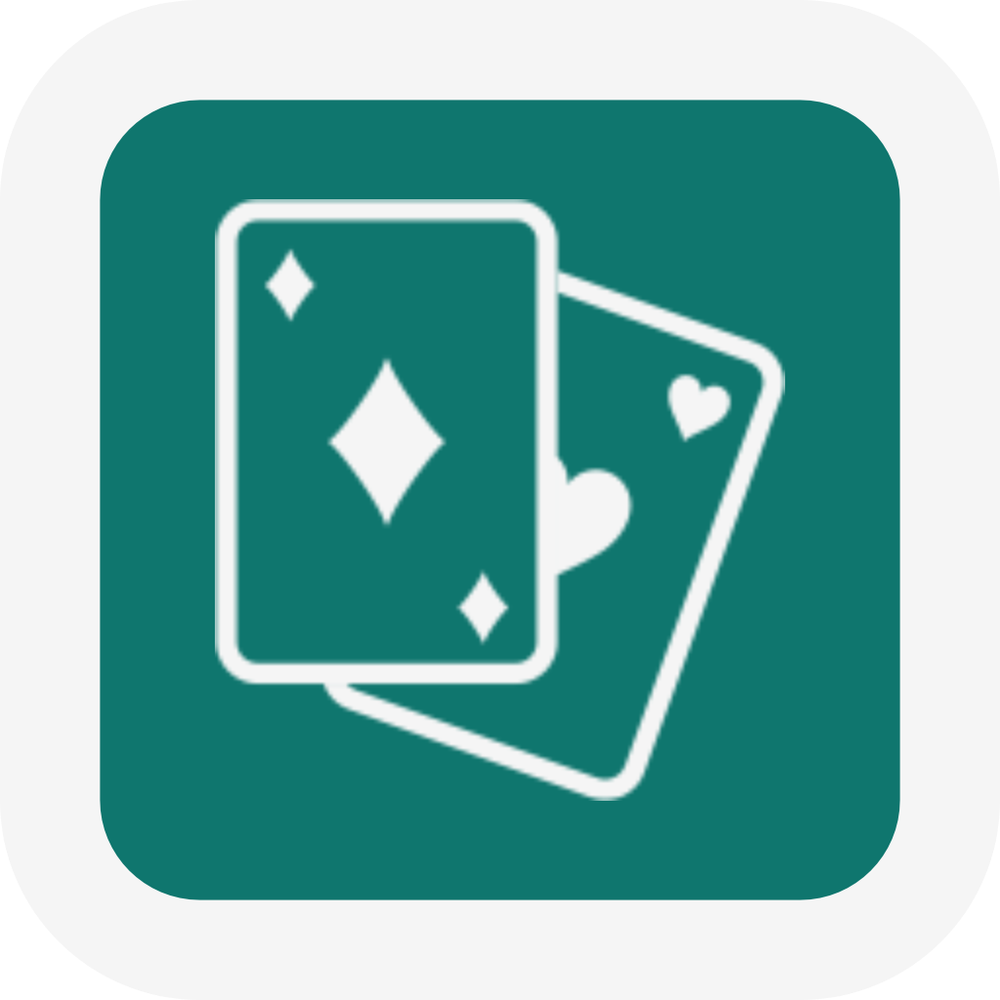

<h1 align="center">
  
  <br />
  Belot Card Game
</h1>

<p align="center">
  A fully playable iOS implementation of the classic Belot card game — with bots, trump selection, scoring, and declaration handling.
</p>


---

## What is Belot Card Game?

**Belot Card Game brings Croatia's most-played card game to iOS in full:**

- Complete Belot rules — tricks, trump selection, forced suit following, and fall/pass scoring
- Play against three AI opponents with realistic think-time and legal-move validation
- Full declaration system — sequences (terza, kvarta, kvinta), four-of-a-kind, and Bela
- Bela Blok — a built-in digital scorekeeper for live games at the table
- Choose your match length: 501, 701, or 1001 points
- Dark mode, two card styles, sound, haptics, and full Croatian/English localization

**`No account needed. No internet required. Just open and play.`**

---

## How It Works

Getting started is instant:

1. **Clone the repo** — `git clone https://github.com/nikomarinovic/Belot-Card-Game.git`
2. **Open in Xcode** — `open Belot-Card-Game.xcodeproj`
3. **Build & run** — target a simulator or physical device and hit `⌘R`
4. **Set up your profile** — choose a username and avatar on first launch
5. **Pick a score threshold** — 501, 701, or 1001 points
6. **Select trump** — choose your trump suit (or pass to the next player)
7. **Play your hand** — follow tricks, declare combinations, call Bela, and outscore your opponents

> [!TIP]
> Run on a physical iPhone for the best experience — touch interactions and card animations feel most natural on device.

---

## Features

### Gameplay
- **Full Belot Rules** — complete implementation of every rule including trump hierarchy, forced following, and the fall/pass scoring system
- **Trump Selection Flow** — each round opens with a full trump-calling round starting right of the dealer; if all pass, the dealer must choose
- **Legal Move Enforcement** — the game validates every card play in real time; illegal moves are rejected with a localized error message
- **Trick Scoring** — all 32 cards have correct point values (trump Jack = 20 pts, trump Nine = 14 pts, etc.)
- **Last Trick Bonus** — the team that wins the final trick of a round receives +10 points

### Declarations
- **Sequences** — terza (3 cards = 20 pts), kvarta (4 cards = 50 pts), kvinta (5+ cards = 100 pts)
- **Four of a Kind** — Jacks (200 pts), Nines (150 pts), Aces/Tens/Kings/Queens (100 pts each)
- **Bela** — King + Queen of the trump suit (+20 pts), detected automatically and prompted during play
- **Declaration Winner** — only the team with the stronger declaration scores; ties resolved by trump suit and turn order

### AI Opponents
- **Three bot opponents** per game, each with a unique randomly generated Croatian nickname and animal avatar
- **Trump selection logic** — bots dynamically calculate pass probability based on suit distribution in their hand
- **Legal play only** — bots use the same `playableCards()` validation as the human player; they can never cheat
- **Realistic timing** — bots wait 1–2.5 seconds before acting to simulate natural play rhythm

### Bela Blok
- **Digital scorekeeper** for live games — use the app as a replacement for pen and paper while playing physically
- **Automatic calculation** — enter your team's points, the app computes the opponent's score and tracks running totals
- **Round history** — full chronological log of every round in the current session
- **Fall and pass tracking** — correctly handles all special scoring situations

### Additional
- **Profile system** — custom username (up to 10 characters) and avatar selection, persisted across launches
- **Dark / Light mode** — instant switching, applied app-wide including card visuals
- **Two card styles** — traditional illustrated cards (hand-scanned and digitally processed) and a minimal style
- **Localization** — full Croatian and English UI with runtime language switching, no restart required
- **Sound & Haptics** — toggleable feedback for card plays and game events

---

## Game Rules Reference

### Card Hierarchy

| Rank | Normal Suit | Trump Suit |
|---|---|---|
| Jack | 5th (2 pts) | **1st — Strongest (20 pts)** |
| Nine | 6th (0 pts) | **2nd (14 pts)** |
| Ace | 1st (11 pts) | 3rd (11 pts) |
| Ten | 2nd (10 pts) | 4th (10 pts) |
| King | 3rd (4 pts) | 5th (4 pts) |
| Queen | 4th (3 pts) | 6th (3 pts) |
| Eight | 7th (0 pts) | 7th (0 pts) |
| Seven | 8th (0 pts) | 8th (0 pts) |

### Declarations

| Name | Description | Points |
|---|---|---|
| Terza | 3 consecutive cards, same suit | 20 |
| Kvarta | 4 consecutive cards, same suit | 50 |
| Kvinta | 5+ consecutive cards, same suit | 100 |
| Four of a Kind | 4 Aces / Tens / Kings / Queens | 100 |
| Four Nines | All four 9s | 150 |
| Four Jacks | All four Jacks | 200 |
| Bela | King + Queen of the trump suit | 20 |

---

## Architecture

The project is structured using the **MVVM (Model–View–ViewModel)** pattern.

**Key design decisions:**

- All game rule logic lives in `GameManager` — bots call the same validation functions as the human player, ensuring consistency and preventing duplication
- `AIBot` holds an `unowned` reference to `GameManager` to avoid retain cycles
- Bot actions use `Swift Concurrency` (`Task`, `@MainActor`, `Task.sleep`) for safe async timing
- All UI text is routed through a `LanguageManager` singleton with a custom `.localized` String extension, making localization a one-word addition

---

## Project Structure

```
Belot-Card-Game/
├── Belot-Card-Game.xcodeproj/      # Xcode project file
├── Belot-Card-Game/
│   ├── GameManager.swift           # Core ViewModel — all game logic
│   ├── Bot.swift                   # AIBot class (trump & card logic)
│   ├── Belot_Card_GameApp.swift    # App entry point & language init
│   ├── ContentView.swift           # Main screen
│   ├── GameView.swift              # In-game screen (trump, tricks, melds)
│   ├── LobbyView.swift             # Pre-game lobby & player setup
│   ├── BelaBlokView.swift          # Digital scorekeeper module
│   ├── SettingsView.swift          # Settings screen
│   ├── ProfileSetupView.swift      # First-launch profile setup
│   ├── MenuView.swift              # Side navigation menu
│   ├── LanguageManager.swift       # Runtime localization manager
│   ├── Localizable/
│   │   ├── en.lproj/               # English strings
│   │   └── hr.lproj/               # Croatian strings
│   └── Assets.xcassets/            # App icons, card images, avatars
├── avatar-images/                  # Player avatar source assets
└── belot playing cards/            # Full 32-card deck image assets
```

---

## Data & Privacy

Belot Card Game stores no user data outside the device. All game state is held in memory during a session. The only persistent data is your profile (username, avatar) and settings (language, dark mode, sound), stored locally via `UserDefaults`.

> Nothing is transmitted. No analytics. No tracking.

---

> [!NOTE]
> This project was developed as a final academic project (završni rad) at Tehnička škola Ruđera Boškovića, Zagreb, 2026. It is published for viewing, learning, and portfolio purposes.

> [!WARNING]
> You may not redistribute, modify, or use this code to build derivative applications without explicit written permission from the author.

---

<h3 align="center">
  Belot Card Game does not accept feature implementations via pull requests.<br />
  Feature requests and bug reports are welcome through GitHub Issues.
</h3>

---

<p align="center">
  © 2026 Niko Marinović. All rights reserved.
</p>
